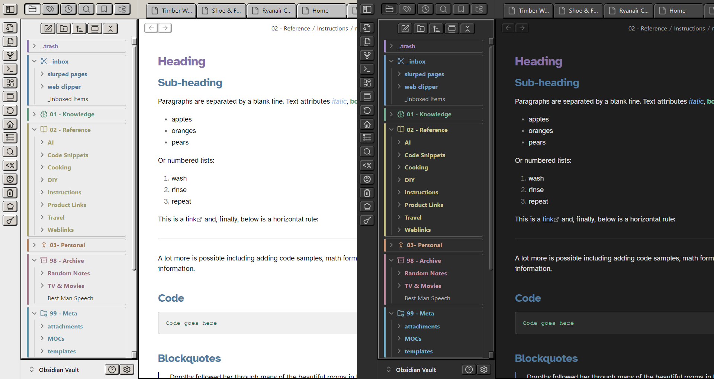
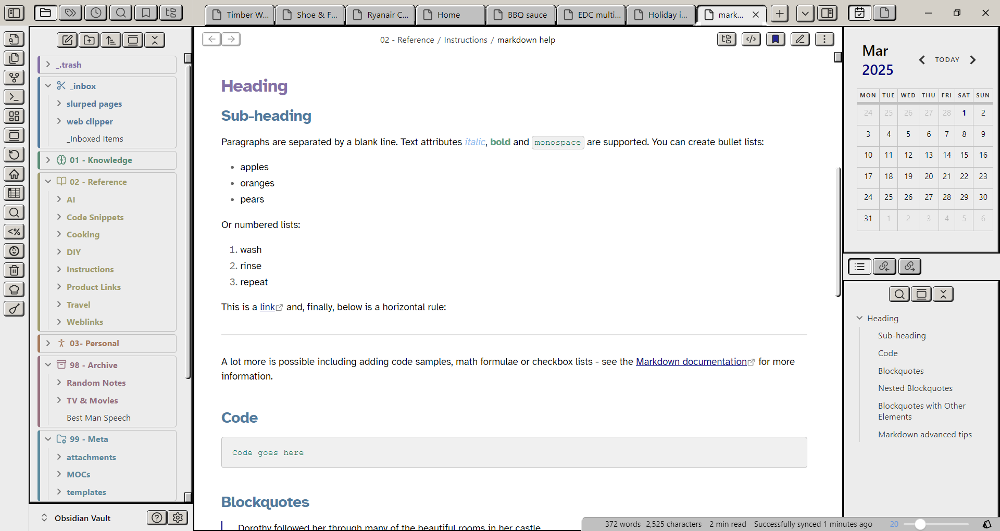
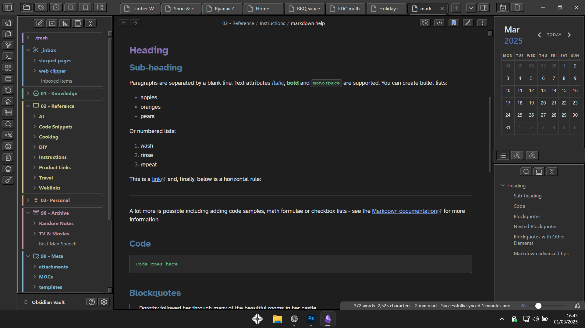

## Retro Windows theme

Give your notes a nostalgic journey back to the early 1990s computing era. This theme recreates the classic Windows 3.1 aesthetic with its iconic gray interface, 3D-effect buttons, and pixelated charm. Available in both light and dark variants, it combines vintage visual appeal with modern note-taking functionality. Perfect for users who appreciate computing history or simply want a unique, visually distinctive Obsidian experience.

---

A nostalgic Obsidian theme that brings back the classic look and feel of Windows 3.1.

## Features

- **Authentic Windows 3.1 Aesthetics**: Classic gray interface, 3D-effect buttons, blue title bars, and pixelated charm
- **Dual Theme Support**: Choose between light and dark variants
- **Color-Coded Folders**: Easily distinguish between different folders with the classic color scheme
- **Classic Typography**: Uses "MS Sans Serif" and "Courier New" fonts for that authentic feel
- **Styled UI Elements**: Specially designed scrollbars, buttons, and windows that mimic the Windows 3.1 interface
- **Markdown Formatting**: Custom styling for code blocks, headings, lists, and other markdown elements

## Installation

1. Open Obsidian Settings
2. Navigate to Appearance → Themes
3. Click "Manage" and search for "Retro Windows"
4. Click "Install and use"

## Manual Installation

1. Download the `theme.css` file
2. Copy it to your vault's `.obsidian/themes/retro-windows/` directory
3. Open Obsidian Settings → Appearance → Themes and select "Retro Windows"

## Screenshots

## Customization

The theme includes variables at the top of the CSS file that can be adjusted to customize colors, fonts, and other elements.
I may add support for Style Settings plugin in the future.

## Optional Fonts & Plugins
### Fonts
- **Text font** Atkinson Hyperlegible: https://fonts.google.com/specimen/Atkinson+Hyperlegible
- **Monospace font** JetBrains Mono: https://www.jetbrains.com/lp/mono/
- Interface font is just Obsidian default.

### Plugins
**Iconize** for icons beside note folders: https://github.com/FlorianWoelki/obsidian-iconize

## Credits

Thanks to Reddit user "jwintyo" for his coloured folders code.

## License

MIT License
